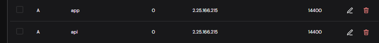
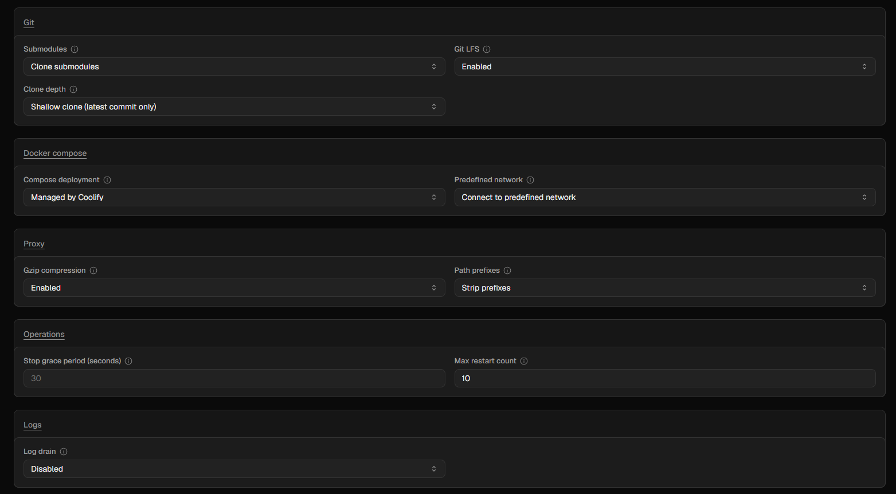
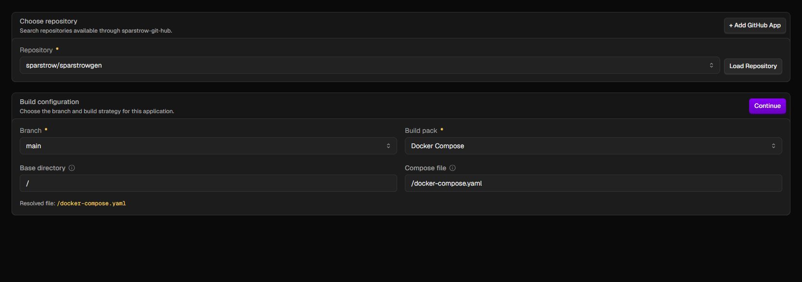
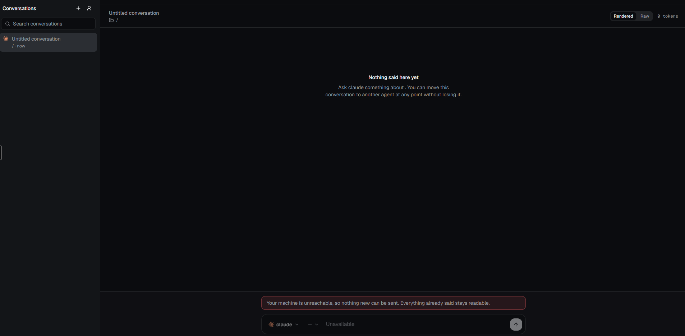

# Deploying sparstrowgen to Coolify

Only a human can complete this runbook: it requires access to Coolify, DNS and
secrets. It is written against **Coolify v4.3.18** and records what the first
real production deployment did, including the parts where Coolify behaved
differently from its labels.

Follow the seven steps in order. Each step says both **what to do** and **what
becomes true afterwards**, so a failure can be located without guessing.

---

## What you are building

```text
                         Coolify on the VPS
browser ───────────────► web       Next.js UI       app.sparstrow.com
          HTTPS         server    Go API           api.sparstrow.com
                         migrate   database job      exits after succeeding
                         postgres  separate resource

your Windows PC ──────► daemon ──WSS──► server
                         │
                         └── starts the installed Claude, Codex and agy CLIs
```

The web app and API are hosted. The daemon is not: it stays on the computer
where the coding-agent CLIs and project files live, and it dials **out** to the
API. Nothing connects inward to the PC, so no port forwarding or VPN is needed.

### Why there are two domains

- `https://app.sparstrow.com` is what the person opens.
- `https://api.sparstrow.com` receives API and WebSocket traffic.

They are separate origins but the same site (`sparstrow.com`), so the secure
session cookie works between them. The values must match the Coolify domains
exactly; `web.sparstrow.com`, a missing `https://`, or a trailing slash is a
different origin and will be refused.

---

## Before you start

- A Coolify project and environment exist.
- Postgres exists as a **separate resource in the same environment**.
- You can install a GitHub App on the repository.
- You know the VPS public IP.

Create these DNS A records at the DNS provider. The screenshot is from
Hostinger; use the IP of the VPS being deployed to, not an IP copied from this
image.

| Type | Name | Points to |
|---|---|---|
| A | `app` | the Coolify VPS public IP |
| A | `api` | the Coolify VPS public IP |



DNS can be created before the application. Coolify will check it when the
domains are attached in step 5.

---

## 1. Generate and save the daemon token

The daemon token proves that the program on a computer is allowed to connect to
this server. It is **not** the browser account password.

On Windows PowerShell, generate one with:

```powershell
$bytes = New-Object byte[] 48
$rng = [Security.Cryptography.RandomNumberGenerator]::Create()
$rng.GetBytes($bytes)
$rng.Dispose()
[Convert]::ToBase64String($bytes)
```

Save the output in a password manager. Do not paste it into chat, source code or
a screenshot. The same value is entered in Coolify in step 4 and on the PC in
step 7. The server rejects values shorter than 32 characters.

**After this step:** one saved secret exists, but nothing is connected yet.

---

## 2. Get the database URL and connect the shared network

Open the Postgres resource in the target Coolify environment and copy its
**internal** connection URL, which has this shape:

```text
postgres://postgres:<password>@<internal-host>:5432/postgres
```

Copy it exactly. Do not construct the hostname from the resource name. On the
first v4.3.18 production deployment, the host in Coolify's internal URL was the
database resource UUID; the visible resource name and container labels were not
a reliable way to predict it.

Now open the sparstrowgen application → **Advanced** → **Docker compose** and
set **Predefined network** to **Connect to predefined network**.



### Why this switch matters

Coolify normally gives each Compose application an isolated network. Postgres
is deliberately a separate Coolify resource, so the migration and API
containers cannot resolve or reach it until both resources share Coolify's
predefined network. A wrong setting here produces a real hostname-resolution or
connection error in the `migrate` log; read that error before changing anything.

**After this step:** the application containers will be able to address the
separate Postgres resource using the host already present in its internal URL.

---

## 3. Connect GitHub and create the Compose application

In Coolify, open the project → target environment → **+ New Resource** →
**Application** → **GitHub App**.

If this Coolify instance has no GitHub source yet:

1. Create the GitHub App through Coolify's automated installation.
2. Install it on the `sparstrow` organization.
3. Choose **Only select repositories** and select `sparstrowgen`.
4. Pull-request access can remain **No access** for production-only deployment.
   That disables PR preview/status features; it does not disable deployment
   after a merge. The push webhook on `main` performs that deployment.

Back in the new-resource screen, select `sparstrow/sparstrowgen`, click **Load
Repository**, then use:

| Field | Value |
|---|---|
| Branch | `main` |
| Build Pack | **Docker Compose** |
| Base Directory | `/` |
| Docker Compose Location | `/docker-compose.yaml` |



Click **Continue**, then **Load Compose** on the application page. Do not paste
Compose YAML into the raw editor and do not use `compose.dev.yaml`; that file is
only for a local Postgres development environment.

### Why Docker Compose

This repository is one product made of three coordinated services:

- `migrate` updates the database and must finish successfully first;
- `server` starts the API only after migration succeeds;
- `web` starts the browser UI alongside the server.

Docker Compose gives Coolify that relationship from the repository instead of
requiring three separately configured applications.

**After this step:** Coolify knows what to build from `main`, but the generated
required variables are not safe to deploy until step 4.

---

## 4. Enter the environment variables

Open **Environment Variables**. Coolify creates the required rows from
`docker-compose.yaml`. Open each row using its gear icon and set it exactly as
shown below.

| Variable | Value | Literal | Build time | Runtime |
|---|---|---:|---:|---:|
| `DATABASE_URL` | internal URL copied in step 2 | Yes | Off | On |
| `DAEMON_TOKEN` | saved token from step 1 | Yes | Off | On |
| `WEB_ORIGIN` | `https://app.sparstrow.com` | No | Off | On |
| `API_ORIGIN` | `https://api.sparstrow.com` | No | **On** | **On** |
| `OWNER_EMAIL` | the address you will sign in with | No | Off | On |
| `ALLOWED_EMAILS` | other invited addresses, comma-separated; may be empty | No | Off | On |
| `SMTP_HOST` | the mailbox's outgoing server, e.g. `smtp.hostinger.com` | No | Off | On |
| `SMTP_PORT` | `465` (TLS) — or `587` if the mailbox only offers STARTTLS | No | Off | On |
| `SMTP_USERNAME` | the sending mailbox's full address | No | Off | On |
| `SMTP_PASSWORD` | that mailbox's password | Yes | Off | On |
| `MAIL_FROM` | `sparstrowgen <agent@sparstrow.com>` | No | Off | On |

No dedicated sending mailbox is needed — `agent@sparstrow.com` (the same mailbox
already used as `OWNER_EMAIL`) sends its own confirmation and reset mail, so
`SMTP_USERNAME` and the address inside `MAIL_FROM` are that same mailbox. Read
its outgoing (SMTP) server and port from that mailbox's configuration page in
Hostinger rather than copying the example above. Mail sent through the
domain's own mailbox is what keeps confirmation links out of spam folders.

**Upgrading an existing deployment:** set these seven before the release that
introduced them reaches `main`. Compose refuses to deploy with any required one
empty, and the server refuses to start with incomplete mail settings — both name
the variable and never its value.

`Literal` means Coolify keeps `$` characters unchanged. It is important for a
database password or token that happens to contain one. No password hash is
needed: the first browser account is created in step 6.

### Build time versus runtime

- **Build time** supplies a value while an image is being created. The browser
  API address is compiled into the Next.js bundle, so changing `API_ORIGIN`
  requires a rebuild.
- **Runtime** supplies a value while Compose evaluates and starts the deployed
  services. The server needs its database URL, daemon token and allowed browser
  origin then.

Although `API_ORIGIN` is used as a build argument, Coolify v4.3.18 also needs
its Runtime switch on. Coolify runs `docker compose pull` with the runtime
`.env` first, and Compose interpolates the build argument during that command.
With Runtime off, deployment fails with `API_ORIGIN is missing a value` before
the build begins. Keeping Runtime on does not place it in the running web
container; the Compose file only maps it to a build argument.

### Required-variable trap in v4.3.18

The Compose file intentionally uses message-free `${VAR:?}` expressions.
v4.3.18 treated text in `${VAR:?helpful message}` as the generated variable's
actual value. During the first attempt, `migrate` received `set this to the
Postgres resource internal URL` and Goose correctly rejected it as malformed.
Always inspect generated values before deploying; **Load Compose preserves a
bad value already saved in Coolify**.

**After this step:** Compose can be evaluated, the server has its runtime
configuration, and the web image knows the public API address.

---

## 5. Attach the two domains and deploy

Open **Domains**. Replace Coolify's generated `sslip.io` addresses with:

| Service | Protocol | Domain | Internal port | Path |
|---|---|---|---:|---|
| `web` | HTTPS | `app.sparstrow.com` | `3000` | blank |
| `server` | HTTPS | `api.sparstrow.com` | `8080` | blank |

Enable HTTP → HTTPS redirection. Click **Check All DNS**; both rows should say
**DNS matches**.

The Domains table must retain internal ports `3000` and `8080`. The production
Compose file declares them with `expose:` so Coolify's proxy knows where to send
traffic. They are private container ports—do not add `:3000` or `:8080` to the
public URLs.

If Coolify says:

```text
No internal ports. Set port expose or per domain internal port so the proxy can route to this domain.
```

reload the current `/docker-compose.yaml` and confirm the deployed commit
contains the `expose:` entries. Typing the port repeatedly into a domain modal
did not solve this on the first deployment; correcting Compose did.

Click **Deploy**. The expected lifecycle is:

1. `migrate` runs migrations and exits successfully;
2. `server` starts and listens on `0.0.0.0:8080`;
3. `web` starts and serves the UI on port `3000`.

Check the API independently:

```powershell
Invoke-RestMethod https://api.sparstrow.com/api/health
```

An `ok` value of `true` proves the public proxy reaches the API. Also open
`https://app.sparstrow.com`; a fresh database shows **Create your account**.

Coolify may label the Compose resource **Running (no healthcheck)** even though
the `server` service declares a Docker healthcheck. Treat the public health
endpoint and the service logs as the operational evidence, not that aggregate
label.

**After this step:** the website and API are publicly reachable over HTTPS, but
there is still no owner account and no computer connected.

---

## 6. Create the owner account

Open `https://app.sparstrow.com/register` and enter the address you set as
`OWNER_EMAIL`. The page says **Check your email**, and the email arrives from
`MAIL_FROM` within a minute. Open its link, choose a password of at least 12
characters (save it in a password manager), and you land signed in.

If no email arrives, check spam, then open **Runtime Logs** → the newest
`server-...` row and look for `could not send a confirmation email`. The text
after `err=` is the mail server's own answer — most often a wrong
`SMTP_PASSWORD` or port.

**An existing deployment keeps its owner account.** The account created earlier
with a setup code, and every conversation in it, are kept by the upgrade; sign in
as before. `OWNER_EMAIL` must be that account's address, or the daemon in step 7
is refused.

**Inviting someone:** add their address to `ALLOWED_EMAILS` and redeploy. They
register at `/register` the same way you did. An address that is not invited is
not refused: it becomes an access request, and you receive one email about it.
Approve it the same way, by adding the address.

**A forgotten password** is reset from **Forgot your password?** under the sign-in
form. The link goes to the account's own address, and using it signs every other
browser out. Changing a password you still know is done from the account menu.

After sign-in, the conversation screen can still say **Your machine is
unreachable**. That is success for this step: browser authentication works, but
the separate daemon connection in step 7 has not happened yet.



**After this step:** the owner can sign in, invited people can create their own
accounts, and nobody else can — each account sees only its own work.

---

## 7. Point the local daemon at production

On the Windows computer that has the agent CLIs and project files, set:

```powershell
setx SERVER_WS "wss://api.sparstrow.com/daemon"
setx DAEMON_TOKEN "<the same saved token from step 1>"
```

Close that terminal and open a **new** one—`setx` changes future processes, not
the shell already open. Start the daemon from the repository:

```powershell
Set-Location D:\sparstrowgen\server
go run ./cmd/daemon
```

The daemon dials outward and logs `connected` on success. In the browser, the
unreachable banner disappears and the installed providers become available in
the provider picker. Confirm all expected providers (`claude`, `codex`, `agy`)
appear before sending a real prompt.

If the daemon says:

```text
the server rejected this machine: DAEMON_TOKEN does not match the server's
```

the Coolify and Windows values differ. Correct the value; do not diagnose that
message as a DNS or firewall problem.

The daemon works for the `OWNER_EMAIL` account. If the server refuses it because
the owner account does not exist yet, finish step 6 first and start the daemon
again. Other accounts cannot use this computer; each person's own computer is
connected by pairing, which is not built yet.

**After this step:** the hosted UI can send work through the hosted server to
the coding-agent CLIs on this computer, while the computer still accepts no
inbound connection.

---

## When something is wrong

| Symptom | What the observed evidence means |
|---|---|
| Deploy is blocked naming a variable | That required variable is empty. Set it under Environment Variables. |
| `API_ORIGIN is missing a value` during `docker compose pull` | Enable both Build time and Runtime for `API_ORIGIN`. |
| Goose cannot parse `set this to the Postgres resource internal URL` | Coolify retained the old generated placeholder as `DATABASE_URL`; replace it with the internal Postgres URL. |
| `migrate` reports hostname resolution or connection failure | Read the full log, then verify the predefined network and the unmodified internal URL from the Postgres resource. |
| Domains shows a red no-internal-port warning | Reload current Compose and verify `expose: 3000` / `8080`; do not keep retyping a port that does not persist. |
| App loads but its requests fail | Confirm the browser is at exactly `https://app.sparstrow.com` and `WEB_ORIGIN` matches it. |
| Sign-in succeeds, then the next request says signed out | Verify HTTPS and `SESSION_SECURE=true`; the `__Host-` cookie requires both. |
| The server exits at start naming `SMTP_...`, `MAIL_FROM` or `OWNER_EMAIL` | That setting is missing or malformed. The log names the variable, never its value. |
| No confirmation or reset email arrives | Check spam, then read the `server` log for `could not send`; the error is the mail server's answer. |
| The daemon is refused: the owner account does not exist yet | Register `OWNER_EMAIL` at `/register` (step 6), then start the daemon again. |
| Somebody uninvited says they signed up | They sent an access request and you were emailed about it. Add the address to `ALLOWED_EMAILS` to approve. |
| Signed-in screen says the machine is unreachable | Hosting and login work; the daemon in step 7 is not connected. |
| Providers remain unavailable | Read the daemon log and verify step 7's WebSocket URL and token. |

## What this deployment does not have yet

- **Invitations are configuration.** Inviting or approving somebody means editing
  `ALLOWED_EMAILS` and redeploying; a place in the product for it is
  [`Later.md`](../Later.md) L-18.
- **One shared daemon token for every machine.** A token cannot yet be revoked
  for only one computer ([`Later.md`](../Later.md) L-16).
- **No directory allowlist.** The daemon can run an agent in a folder named by
  an authenticated request.
- **Backups are Coolify's Postgres backups.** There is no application-level
  backup system.
