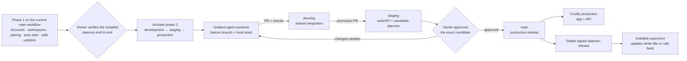

# Intended product and release workflow

**Status: proposed for owner verification.** This is the destination, not a
description of automation that exists today. The branch workflow in phase 2
must not be activated until phase 1 has been completed and verified.

This runbook describes what the release experience should feel like from the
owner's and an installed user's side. The agent rules that enforce it live in
[`WORKFLOW.md`](../../WORKFLOW.md). The editable diagram is
[`release-workflow.excalidraw`](release-workflow.excalidraw).

## Phase 1 — make the daemon a managed product

Keep the existing `main`-only workflow while this phase is built. Feature
branches still reach `main` through pull requests, and `main` remains the
production deployment.

The owner-visible outcomes are drafted in
[`2026-09-12-account-workspace-onboarding.md`](../specs/2026-09-12-account-workspace-onboarding.md),
[`2026-09-12-managed-runtimes.md`](../specs/2026-09-12-managed-runtimes.md) and
[`2026-09-12-product-destinations-and-settings.md`](../specs/2026-09-12-product-destinations-and-settings.md),
with account-wide appearance choices in
[`2026-09-12-appearance-preferences.md`](../specs/2026-09-12-appearance-preferences.md).
They remain drafts until the owner approves them; implementation does not start merely because
this workflow selected the feature.

The current static `DAEMON_TOKEN` remains valid while the replacement is
introduced. The server first learns both credential types, then paired daemons
are installed and verified, and only then may the shared token be retired. A
server release must never require a daemon version that users had no chance to
receive first.

From an installed user's point of view, the finished experience is:

1. Download one signed Windows installer from a stable product link. GitHub
   Releases may store the file, but release mechanics are not shown in the app.
2. The installer starts a per-user supervisor automatically when Windows signs
   in. It runs with the person's own files, `PATH` and coding-agent credentials;
   it is not a `LocalSystem` service.
3. Pair the computer in the browser. The server issues a separate credential
   for that machine and stores only a hash of it. No Coolify access and no
   shared production secret are given to the user.
4. The app shows the machine's name, connection state, daemon version, update
   health, detected providers and models. Access for one machine can be revoked
   without disturbing another.
5. The supervisor checks the stable update channel and may prepare a download,
   but it does not switch versions or restart while any sparstrowgen agent work
   is active on that computer. It checks for active work again immediately
   before activation, verifies the signed download and checksum, switches
   versions, restarts and reconnects. If startup or compatibility checks fail,
   it rolls back.
6. Successful updates are quiet. The app surfaces only action that a person
   needs to take: pairing approval, an incompatible version, a failed update,
   missing provider authentication, or a revoked machine.

The product must make four jobs directly reachable. Design decides whether each job becomes its
own destination or whether, for example, workspace management is part of switching context:

- **Chat** — conversations and agent work.
- **Workspaces** — create, switch and manage separate bodies of work.
- **Runtimes** — pair and revoke computers; inspect connection, machine,
  daemon, provider and model state.
- **Settings** — account and product preferences that do not belong to one
  conversation or one runtime, including appearance and update behaviour.

A sidebar is the current navigation direction, but this document does not lock
its layout or require four permanent navigation items. The feature still follows
the repository's design process before UI code is written, including populated,
empty, loading and error states.

### Compatibility during phase 1

Daemon and server releases use an expand/contract sequence:

1. Add protocol fields and server behaviour so old and new daemons both work.
2. Deploy the compatible server.
3. Release and update daemons.
4. Measure or visibly confirm that incompatible daemons are gone.
5. Remove the old behaviour in a later release.

Every daemon hello reports daemon version, protocol range and capabilities.
The server responds with compatibility and update status. Missing fields are
treated deliberately as an older client, never as a valid value guessed by the
server.

### Phase 1 exit gate

Phase 2 may begin only after the owner can verify all of these as a normal user:

- a new person can create and verify an account without a server-log setup code;
- that person can create, switch and manage more than one workspace;
- a clean Windows machine can install without cloning the repository;
- first setup can discover the local component, offer installation when absent,
  finish pairing when present, or be skipped and resumed later;
- browser pairing creates a separately revocable machine;
- the daemon starts after sign-in without a terminal;
- Chat can use the machine's providers and models;
- a signed test update waits for idle work, updates, reconnects and preserves
  configuration;
- an update that was ready while idle remains pending if any agent starts before
  activation, and waits until every active agent on that computer has finished;
- an intentionally broken test update rolls back;
- appearance mode, surface and accent choices persist across sign-in and another
  supported browser without changing semantic status meanings;
- an older daemon gets a useful compatibility message rather than failing
  mysteriously.

## Phase 2 — activate development, staging and production promotion

Once phase 1 passes its exit gate, create and protect the long-lived
`develop` and `staging` branches. The same codebase moves through three
environments; differences such as domains, database URLs and release channels
come from environment configuration, never branch-specific source changes.

| Lane | What it is for | Hosted target | Daemon channel |
|---|---|---|---|
| Feature branch in its own worktree | One agent's isolated change and local proof | Unique localhost ports, Compose project, database volume and credentials | Development build; never auto-updates |
| `develop` | Shared integration after feature checks pass | Integration checks; not the owner's production app | Development artifacts only |
| `staging` | The exact release candidate the owner tests | `app.staging.sparstrow.com` and `api.staging.sparstrow.com`, with separate staging Postgres | Candidate |
| `main` | The production version people use | `app.sparstrow.com` and `api.sparstrow.com`, with separate production Postgres | Stable |

### Normal promotion

1. Each coding agent works in its own worktree and feature branch. Its web,
   API, database, daemon, ports, token and Compose project name cannot collide
   with another agent's stack.
2. A pull request into `develop` must pass the repository checks and browser
   verification appropriate to the change. Nobody develops directly on
   `develop`.
3. A promotion pull request moves `develop` to `staging`. Build the web/API
   images and Windows daemon candidate from that exact commit and record their
   immutable digests or checksums.
4. Coolify deploys the staging application against the staging database. Test
   daemons follow the candidate channel. The owner tests the app through the
   staging domains as an ordinary user.
5. If changes are needed, they return through a feature branch and `develop`;
   staging is not patched by hand.
6. After owner approval, promote that exact candidate to `main`. Production
   must use the already-verified image digest and daemon artifact rather than
   rebuilding different bytes from the same source.
7. Verify production health and a real daemon reconnect. Only then publish the
   candidate in the stable channel so installed production supervisors update.

### Failure and rollback

- A failed feature or integration check stops before `develop`.
- A failed staging candidate is replaced by a newer candidate; it never reaches
  `main`.
- A failed web/API production release rolls back to the previous verified image
  digest. Database migrations must be compatible with that rollback.
- A failed daemon update rolls back locally to the previous signed version and
  reports the failure in Runtimes.
- A production hotfix starts from `main`, is proved locally, and reaches
  production through an owner-approved pull request. It is then merged forward
  into `develop` so the lanes do not diverge.

## Owner verification before activation

When phase 1 is complete, review this workflow and confirm:

- the staging domains are the names you want;
- only you can approve `staging` → `main` and a stable daemon release;
- production never builds unverified bytes after staging approval;
- installed users never need GitHub, Git or Coolify access;
- normal daemon updates are silent, while failures and required action are
  visible;
- every agent has a genuinely isolated local stack before `develop` is opened
  to parallel work.

After that confirmation, change `WORKFLOW.md` from **Phase 1** to **Phase 2** in
the same pull request that creates the protected branches and deployment
automation. Until then, agents follow the current `main` pull-request path.
